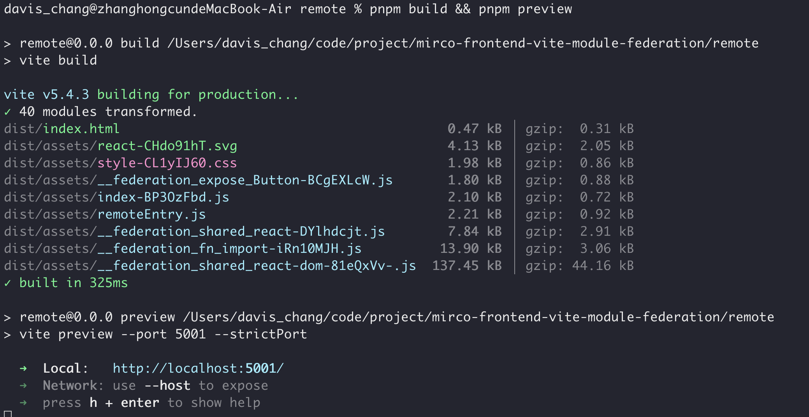
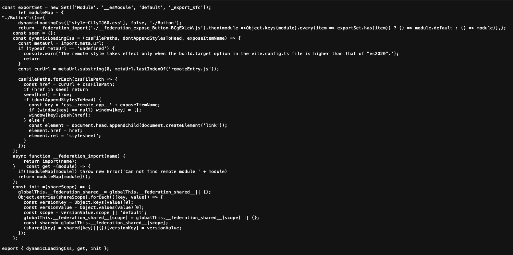
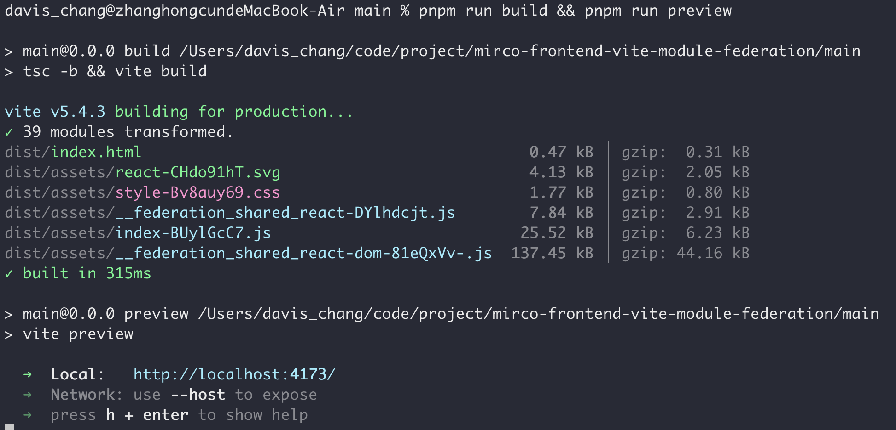

# Micro-Frontend with Vite and Module Federation

This project demonstrates how to build micro-frontends using Vite and the Module Federation plugin. The setup includes two separate projects: a **Remote Project** and a **Main Project**, which share components dynamically using module federation. The build system is powered by `pnpm`.

## Remote Project

1. Install the dependencies:
    ```bash
    $ pnpm i
    ```
2. Build the project and start the preview server:
    ```bash
    $ pnpm run build && pnpm run preview
    ```
3. The build process will generate a manifest file.
4. The remote entry point will be available at: `http://localhost:5001/assets/remoteEntry.js`
5. For production, the static assets should be deployed to a reliable storage service like S3 to ensure availability.

### Build Result - Remote Project
After running the build, the remote project will produce the following result:



### Remote App remoteEntry JS
Once deployed, the remote application produce the following result:
http://localhost:5001/assets/remoteEntry.js



### Remote App Preview
Once deployed, the remote application will look like this:


## Main Project

1. Install the dependencies:
    ```bash
    $ pnpm i
    ```
2. Run the development server or build the project and preview the result:
    ```bash
    $ pnpm run dev
    # or
    $ pnpm run build && pnpm run preview
    ```
3. The Main Project will consume remote components from the **Remote Project**.
4. Be sure to use an `ErrorBoundary` in the module federation setup to handle cases where a package cannot be found.

### Build Result - Main Project
The main project will build and output the following:



### Main App Preview
Here’s how the main application will appear:


---

Make sure to properly handle edge cases in your module federation, especially when components or modules are missing, by utilizing error boundaries to ensure smooth user experience.